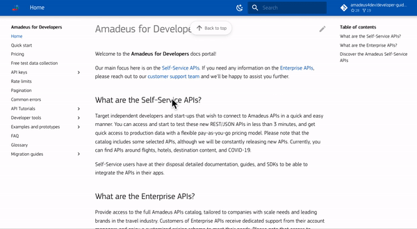

# [DEPRECATED] Developer Guides
**The Amadeus for Developers Self-Service offer has been deprecated. Please check our [press release](https://amadeus.com/en/industry-messaging/statement-regarding-amadeus-for-developers-portal) for more information**

This repository hosts the **developer documentation** for [Amadeus for Developers](https://developers.amadeus.com), offering a comprehensive guide for developers seeking to work with Amadeus Self-Service APIs.

The documentation contains information such as: 
- ✅**Code examples** that you can copy and paste to build 
- 📝**API Tutorials** to explain functionalities and use-cases per API category
- 👩🏻‍💻**Developer Tools** and 📱**Prototypes (Demo Apps)** for you to use and refer to
- Quick start, Test Data Collection, FAQ and more

You can access the documentation ⭐️[Here](https://amadeus4dev.github.io/developer-guides/)

## Contributing

Want to contribute? Read our [Contributors guide](.github/contributing.md) for more information. 

