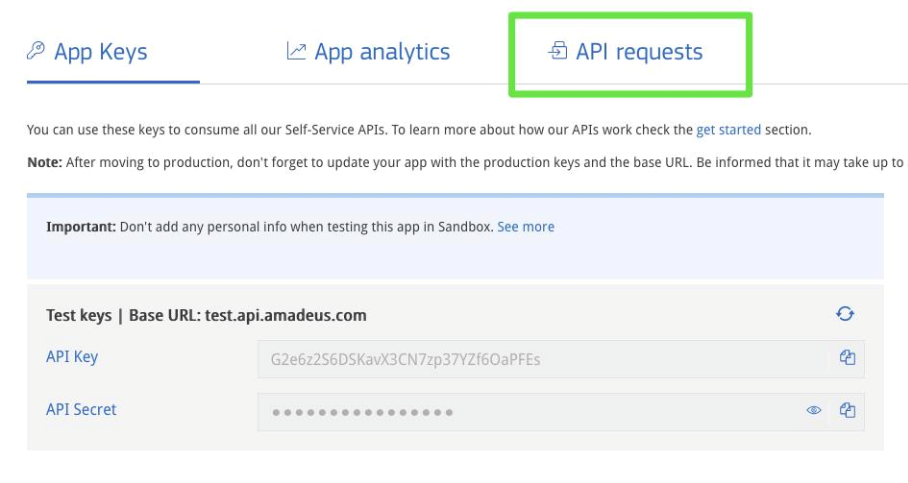
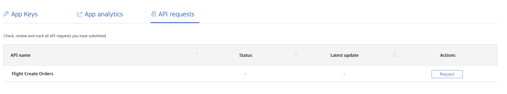

# Moving your application to production

When your application is ready to be deployed to the Real World™, you can request your Production Key and access the `Production Environment`.

## Requesting a production key

To request a **production key**, you must complete the following steps:

1. [Sign in](https://developers.amadeus.com/signin){:target="\_blank"} to your account and enter [My Self-Service Workspace](https://developers.amadeus.com/my-apps){:target="\_blank"}.
2. Select the application to move to `Production` and click `Get production environment` :

    

3. Complete the form with your personal information, billing address, and app information.
4. Indicate whether your application uses `Flight Create Orders` in the checkbox at the bottom of the form. This API has special access requirements detailed below in the `Moving to Production with Flight Create Orders` section of this guide.
5. Select your preferred method of payment \(credit card or bank transfer\) and provide the required billing information.
6. Sign the Terms of Service agreement provided on `Docusign`. 


Once these steps are completed, your application status will be **pending**:


You will receive a notification that your application is validated and the status will change to **live**. This usually occurs within 72 hours. Note that the validation period applies to your first production application. Subsequent applications will be validated automatically.


!!!information
    Production keys are valid for all Self-Service APIs except `Flight Create Orders API`, which has special requirements. See the `Moving to Production with Flight Create Orders` of this guide for more information.

Remember that once you exceed your free transactions threshold, you will be billed automatically for your transactions every month. You can manage and track your app usage in [My Self-Service Workspace](https://developers.amadeus.com/my-apps){:target="\_blank"}.

## Using the production key

Once you have a production key, you can make the following changes to your source code:

* Update the base URL for your API calls to point to `https://api.amadeus.com`.
* Update your `API key` and `API secret` with the new production keys.

If you are using [Amadeus for Developers SDKs](https://github.com/amadeus4dev){:target="\_blank"}, add `hostname='production'` to the `Client` together with your API key and API secret as shown below example in [python SDK](https://github.com/amadeus4dev/amadeus-python){:target="\_blank"}:

```python
from amadeus import Client, ResponseError

amadeus = Client(
    client_id='<YOUR-CLIENT-ID>',
    client_secret='<YOUR-CLIENT-SECRET>',
    hostname='production'
)

try:
    response = amadeus.shopping.flight_offers_search.get(
        originLocationCode='MAD',
        destinationLocationCode='ATH',
        departureDate='2022-11-01',
        adults=1)
    print(response.data)
except ResponseError as error:
    print(error)
```  
Replace `<YOUR-CLIENT-ID>` with your API Key and `<YOUR-CLIENT-SECRET>` with your API Secret in the command above.

## Video Tutorial

You can check the step by step process in this video tutorial of [How to move to production](https://youtu.be/4S0J1vxMt04) from [Get Started series](https://youtube.com/playlist?list=PLBehidtj-OiqQ0sIHBPvwf-8GAjMTJehF). 


## Moving to production with the Flight Create Orders API

Applications using `Flight Create Orders` must meet special requirements before moving to `Production`. The requirements are detailed in the following section.

### Requirements

1. **You have a ticket issuance agreement with a consolidator**. Only certified
   travel agents can issue flight tickets. Non-certified businesses must issue
   tickets via an airline consolidator (an entity that acts as a host agency
   for non-certified agents). The Amadeus for Developers team can assist you in finding a consolidator in your region. 

2. **There are no restrictions in your country**. Though we are working to make Self-Service flight booking available worldwide, `Flight Create Orders` API is currently not available to companies in the following countries: 

    *Algeria, Bangladesh, Bhutan, Bulgaria, Croatia, Egypt, Finland, Iceland,
Iran, Iraq, Jordan, Kuwait, Kosovo, Lebanon, Libya, Madagascar, Maldives,
Montenegro, Morocco, Nepal, Pakistan, Palestine, Qatar, Saudi Arabia, Serbia, Sri Lanka, Sudan, Syria, Tahiti, Tunisia, United Arab Emirates and
Yemen* 

3. **You comply with local regulations** . Flight booking is subject to local
   regulations and many areas (notably, California and France) have special
   requirements.

[Contact us](https://developers.amadeus.com/support/contact-us-self-service){:target="\_blank"} for questions about the above requirements or assistance with local regulations and airline consolidators in your region.

If you meet the above requirements, you are ready to move your application 
to production. 


###  Adding `Flight Create Orders` to a production app

To add `Flight Create Orders` to an application currently in production, select the app in the **My Apps** section of your Self-Service Workspace and click **API requests**:



Then request production access to `Flight Create Orders` by clicking the **Request** button located under **Actions**:

 
