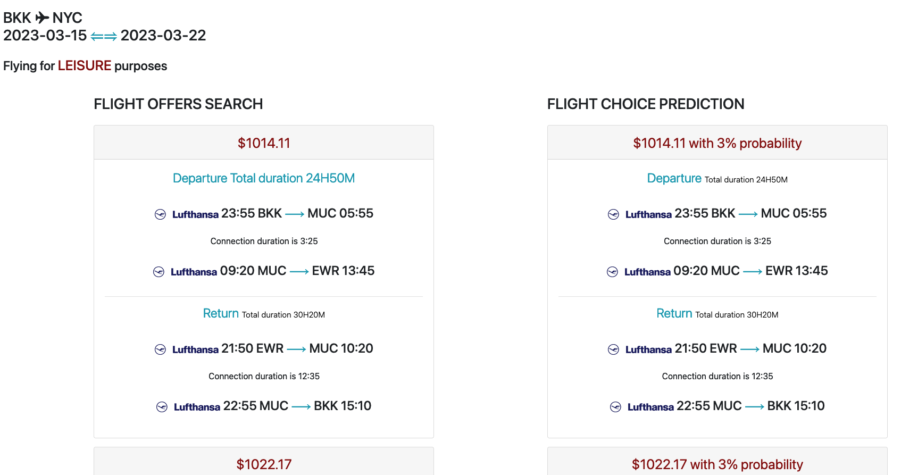
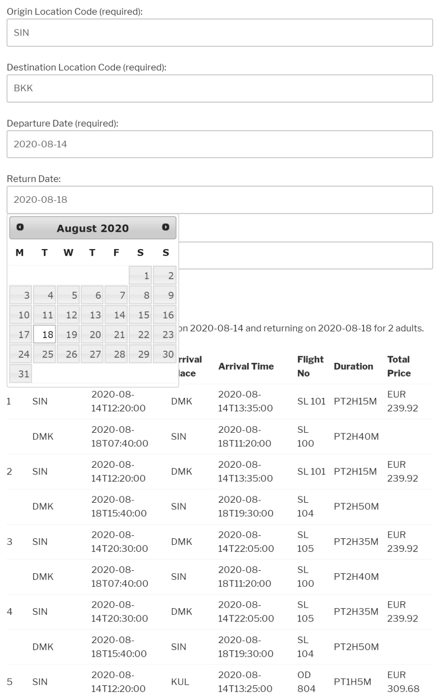

# Prototypes 

Would you like to explore the applications that you could build with Amadeus Self-Service APIs?
We have prototypes available in [Amadeus for Developers GitHub](https://github.com/amadeus4dev).

There are two types of prototypes (demo apps) available. 

* [Official prototypes](#amadeus-official-prototypes-or-demo-apps) are managed by Amadeus for Developers team and updated frequently to the latest version of APIs and SDKs. 
* [Community prototypes](#prototypes-from-community) are examples or demo apps that have been built and managed by developer community and it is not supported or maintained by Amadeus for Developers team. 

## Official Prototypes

| Use Cases                                             | Amadeus APIs used                                                                                           | Technology               | Details                                                                         |
|-------------------------------------------------------|-------------------------------------------------------------------------------------------------------------|--------------------------|---------------------------------------------------------------------------------|
| Flight booking engine                                 | Flight Offers Search, Flight Offers Price, Flight Create Order, Airport & City Search, Travel Restrictions  | Python, django           | [amadeus-flight-booking-django](#amadeus-flight-booking-django)                 |
| Hotel Booking engine                                  | Hotel Search, Hotel Booking                                                                                 | Python, django           | [amadeus-hotel-booking-django](#amadeus-hotel-booking-django)                   |
| Flight Search with Price Analysis & Trip purpose      | Flight Offers Search, Flight Price Analysis, Trip Purpose Prediction                                        | Node, Vue                | [amadeus-flight-booking-node](#amadeus-flight-booking-node)                   |
| Flight Search with Price Analysis & Trip purpose      | Flight Offers Search, Flight Price Analysis, Trip Purpose Prediction                                        | Python, django           | [amadeus-flight-price-analysis-django](#amadeus-flight-price-analysis-django)   |
| Map with Hotels, Point of interests and Safety scores | Hotel Search, Points of Interest, Safe Place                                                                | Python, django, HERE map | [amadeus-hotel-area-safety-pois-django](#amadeus-hotel-area-safety-pois-django) |
| Covid-19 info map                                     | Travel Restrictions                                                                                         | Node, express            | [amadeus-travel-restrictions-node](#amadeus-travel-restrictions-node)           |

### amadeus-flight-booking-django
amadeus-flight-booking-django ([Link to GitHub](https://github.com/amadeus4dev/amadeus-flight-booking-django){:target="\_blank"}) is built with Django and [Python SDK](../programming/python.md) and demonstrates the end-to-end flight booking process (Flight booking engine), which works in conjunction with three APIs: [Flight Offer Search API](https://developers.amadeus.com/self-service/category/air/api-doc/flight-offers-search){:target="\_blank"}, [Flight Offer Price API](https://developers.amadeus.com/self-service/category/air/api-doc/flight-offers-price){:target="\_blank"} and [Flight Create Orders API](https://developers.amadeus.com/self-service/category/air/api-doc/flight-create-orders). 

It also uses [Airport & City Search API](https://developers.amadeus.com/self-service/category/air/api-doc/airport-and-city-search){:target="\_blank"} to autocomplete the origin and destination with IATA code, and [Travel Restrictions API](https://developers.amadeus.com/self-service/category/covid-19-and-travel-safety/api-doc/travel-restrictions){:target="\_blank"} to return COVID-19 travel restriction information for destination country. 

### amadeus-hotel-booking-django
amadeus-hotel-booking-django ([Link to GitHub](https://github.com/amadeus4dev/amadeus-hotel-booking-django){:target="\_blank"}) is built with Django and [Python SDK](../programming/python.md). It demonstrates the end-to-end Hotel booking process (Hotel booking engine), which works in conjunction with three APIs: [Hotel List API](https://developers.amadeus.com/self-service/category/hotel/api-doc/hotel-list){:target="\_blank"}, [Hotel Search API](https://developers.amadeus.com/self-service/category/hotel/api-doc/hotel-search){:target="\_blank"} and [Hotel Booking API](https://developers.amadeus.com/self-service/category/hotel/api-doc/hotel-booking){:target="\_blank"}. 

### amadeus-flight-booking-node 
amadeus-flight-booking-node ([Link to GitHub](https://github.com/amadeus4dev/amadeus-flight-booking-node){:target="\_blank"}) is built by Node, Vue and [Node SDK](../programming/node.md). 

### amadeus-flight-price-analysis-django
amadeus-flight-price-analysis-django ([Link to GitHub](https://github.com/amadeus4dev/amadeus-flight-price-analysis-django){:target="\_blank"}) is built with Django and [Python SDK](../programming/python.md). It retrieves flight offers using the Flight Offers Search API for a given itinerary. Then it displays if the cheapest available flight is a good deal based on the Flight Price Analysis API. We finally predict if the trip is for business or leisure using the Trip Purpose Prediction API.

### amadeus-hotel-area-safety-pois-django
amadeus-hotel-area-safety-pois-django ([Link to GitHub](https://github.com/amadeus4dev/amadeus-hotel-area-safety-pois-django){:target="\_blank"}) built by Django and [Python SDK](../programming/python.md), It demonstrate the safety information, POIs and tours for a chosen hotel on the map, using the following APIs:

* [Hotel Search](https://developers.amadeus.com/self-service/category/hotel/api-doc/hotel-list){:target="\_blank"}: shows hotels on the map
* [Points of Interest](https://developers.amadeus.com/self-service/category/destination-content/api-doc/points-of-interest){:target="\_blank"}: shows POIs around the hotel
* [Safe Place](https://developers.amadeus.com/self-service/category/covid-19-and-travel-safety/api-doc/safe-place){:target="\_blank"}: shows safety information for the area each hotel is located
* [Tours and Activities](https://developers.amadeus.com/self-service/category/destination-content/api-doc/tours-and-activities){:target="\_blank"}: shows bookable tours and activities around the hotel
* [HERE Maps](https://developer.here.com/){:target="\_blank"}: displays a map with markers and text bubbles

### amadeus-travel-restrictions-node

amadeus-travel-restrictions-node ([Link to GitHub](https://github.com/amadeus4dev/amadeus-travel-restrictions-node){:target="\_blank"}) built by Node, Express and [Node SDK](../programming/node.md), It demonstrate Travel Restrictions for USA displayed on a map. We use the following APIs:

* [Travel Restrictions](https://developers.amadeus.com/self-service/category/covid-19-and-travel-safety/api-doc/travel-restrictions){:target="\_blank"}: returns Travel Restrictions
* [HERE Maps for JavaScript](https://developer.here.com/): displays a map with markers and text bubbles

## Prototypes from community 

We have many other prototypes or demo apps that developers in our community built and shared! Explore them in [Amadeus for Developers -Examples GitHub](https://github.com/amadeus4dev-examples){:target="\_blank"} 

!!! warning
    Projects from communities are examples that have been built and managed by developer community and it is not supported or maintained by Amadeus for Developers team. The projects may not up-to-date. 

!!! danger
    The list of community projects is working in progress.

| Use case                                   | Amadeus APIs used                                                                                 | Technology           | Details                                                                                                          |
|--------------------------------------------|---------------------------------------------------------------------------------------------------|----------------------|------------------------------------------------------------------------------------------------------------------|
| Trip purpose prediction                    | Trip Purpose Prediction                                                                           | Python, django       | [amadeus-trip-purpose-django](#amadeus-trip-purpose-django)                                                                                      |
| Hotel Search                               | Hotel Search                                                                                      | Swift                | [amadeus-hotel-search-swift](#amadeus-hotel-search-swift)                                                                                       |
| Hotel booking engine                       | Hotel Search, Hotel Booking                                                                       | Kotlin               | [amadeus-hotel-booking-android](#amadeus-hotel-booking-android)                                                                                    |
| Flight Search with Artificial intelligence | Flight Offers Search, Flight Choice Prediction, Trip Purpose Prediction and Airport & City Search | Python, django       | [amadeus-smart-flight-search-django](#amadeus-smart-flight-search-django)                                                                              |
| Flight Search                              | Flight Offers Search                                                                              | PHP, wordpress       | [amadeus-flight-search-wordpress-plugin](#amadeus-flight-search-wordpress-plugin)                                                                           |
| Flight Booking engine                      | Flight Offer Search, Flight Offers price, Flight Create Orders, Airport & City Search             | Java, React          | [amadeus_java_flight_api](#amadeus_java_flight_api)                                                                                          |
| Airport & City autocomplete                | Airport & City Search                                                                             | Node, express, React | [amadeus-airport-city-search-mern](#amadeus-airport-city-search-mern)                                                                                 |
| Flight Seatmap display                     | SeatMap Display                                                                                   | React                | [amadeus-seatmap](#amadeus-seatmap)                                                                                                  |
| Hotel booking engine                       | Hotel Search, Hotel Booking                                                                       | React Native         | [AmadeusNodeServer, AmadeusHotelBookingPart1](#amadeusnodeserver-amadeushotelbookingpart1)                                                                      |
| Hotel booking engine                       | Airport & City Search, Hotel Search, Hotel Booking                                                | Node, React          | [Building-a-Hotel-Booking-App-in-NodeJS-and-React](#Building-a-Hotel-Booking-App-in-NodeJS-and-React) |
| Neighborhood safety map                    | Safe Place                                                                                        | Python               | [amadeus-safeplace](#amadeus-safeplace)                                                                                                |
| Map nearby                                 | Point of Interests                                                                                | Swift                | [MyPlaces](#MyPlaces)                                                                                                         |
| Flight Booking engine              | Flight Offer Search, Flight Offers price, Flight Create Orders, Airport & City Search             | Node, Angular        | [Flight-booking-frontend and backend](#Flight-booking-frontend and backend)                                                                                                                                                                   |
| Flight Search backend                      | Flight Offer Search, Airport & City Search                                                        | Bootstrap, Vanila JS | [Building-a-Flight-Search-Form-with-Bootstrap-and-the-Amadeus-API](#Building-a-Flight-Search-Form-with-Bootstrap-and-the-Amadeus-API)                                          |
| Map nearby                                 | Point of Interests                                                                                | Android              | [Amadeus_POI_Android](#Amadeus_POI_Android)                                                                                              |
| Hotel booking engine                       | Hotel Search, Hotel Booking                                                                       | Roby on Rails        | [amadeus-hotel-booking-rubyonrails](#amadeus-hotel-booking-rubyonrails)                                                                                |
| Flight status notification service         | On-Demand Flight Status                                                                           | Python               | [amadeus-async-flight-status](#amadeus-async-flight-status)                                                                                      |
| Flight Calendar search                     | -                                                                                                 | Node                 | [FlightSearchCalendar](#FlightSearchCalendar)                                                                                             |
| Airport & City autocomplete                | Airport & City Search                                                                             | Node and Express     | [Live-Airport-City-Search](#Live-Airport-City-Search)                                                                                         |

### amadeus-trip-purpose-django

This project ([Link to GitHub](https://github.com/amadeus4dev-examples/amadeus-trip-purpose-django){:target="\_blank"}) demonstrates how to integrate Amadeus APIs using the [Python SDK](../programming/python.md) in a Django application.

The end user submits round-trip information via a form and the [Trip Purpose Prediction](https://developers.amadeus.com/self-service/category/trip/api-doc/trip-purpose-prediction){:target="\_blank"} is called. This API predicts if a the given journey is for leisure or business purposes.

### amadeus-hotel-search-swift

### amadeus-hotel-booking-android

###  amadeus-smart-flight-search-django
This prototype ([Link to GitHub](https://github.com/amadeus4dev-examples/amadeus-smart-flight-search-django){:target="\_blank"}) shows how the Air APIs can be integrated with Django framework and [Python SDK](../programming/python.md), by calling the [Flight Choice Prediction](https://developers.amadeus.com/self-service/category/air/api-doc/flight-choice-prediction){:target="\_blank"} and [Trip Purpose Prediction](https://developers.amadeus.com/self-service/category/trip/api-doc/trip-purpose-prediction){:target="\_blank"}.

We also call the [Flight Offers Search](https://developers.amadeus.com/self-service/category/air/api-doc/flight-offers-search){:target="\_blank"} as a more traditional method of flight search and we compare its results with the [Flight Choice Prediction](https://developers.amadeus.com/self-service/category/air/api-doc/flight-choice-prediction){:target="\_blank"} ones to show the power of AI.

### amadeus-flight-search-wordpress-plugin

This prototype ([Link to GitHub](https://github.com/amadeus4dev-examples/amadeus-flight-search-wordpress-plugin){:target="\_blank"})  demonstrated how to build a basic flight search feature using the [Flight Offers Search API](https://developers.amadeus.com/self-service/category/air/api-doc/flight-offers-search){:target="\_blank"} with WordPress plugin.

### amadeus_java_flight_api

### amadeus-airport-city-search-mern
This application ([Link to GitHub](https://github.com/amadeus4dev-examples/amadeus-airport-city-search-mern){:target="\_blank"}) implements airport and city name autocomplete box powered by the [Airport & City Search API](https://developers.amadeus.com/self-service/category/air/api-doc/airport-and-city-search){:target="\_blank"}. The solution itself will be comprised of a simple Node.js and Express backend that connects to the Amadeus API with [Node SDK](../programming/node.md), and a small React app that talks to a Node/Express backend and uses it to obtain the airport name data from Amadeus.

### amadeus-seatmap
https://developers.amadeus.com/blog/react-seat-map

### AmadeusNodeServer, AmadeusHotelBookingPart1
https://developers.amadeus.com/blog/react-native-hotel-booking-app, 
https://developers.amadeus.com/blog/react-native-hotel-booking-app-part-2

### amadeus-safeplace
https://developers.amadeus.com/blog/neighborhood-safety-map-python

### Building-a-Hotel-Booking-App-in-NodeJS-and-React

https://developers.amadeus.com/blog/react-hotel-booking-app-part1
https://developers.amadeus.com/blog/react-hotel-booking-app-part2

### MyPlaces
https://developers.amadeus.com/blog/getting-nearby-places-ios-amadeus-api

### Flight-booking-frontend and backend
https://developers.amadeus.com/blog/flight-booking-app-angular-1
https://developers.amadeus.com/blog/flight-booking-app-angular-2

### Building-a-Flight-Search-Form-with-Bootstrap-and-the-Amadeus-API
https://developers.amadeus.com/blog/bootstrap-flight-search-form-part-2
https://developers.amadeus.com/blog/bootstrap-flight-search-form-part-1

### Amadeus_POI_Android

### amadeus-hotel-booking-rubyonrails

### amadeus-async-flight-status

### FlightSearchCalendar

###  Live-Airport-City-Search
This application ([Link to GitHub](https://github.com/amadeus4dev-examples/Live-Airport-City-Search){:target="\_blank"}) lets you perform a live search for Airports and Cities through the [Airport & City Search API](https://developers.amadeus.com/self-service/category/air/api-doc/airport-and-city-search){:target="\_blank"}. The implementation is done through jQuery Autocomplete with Node and Express as the backend for which connects ot the Amadeus API with [Node SDK](../programming/node.md).

