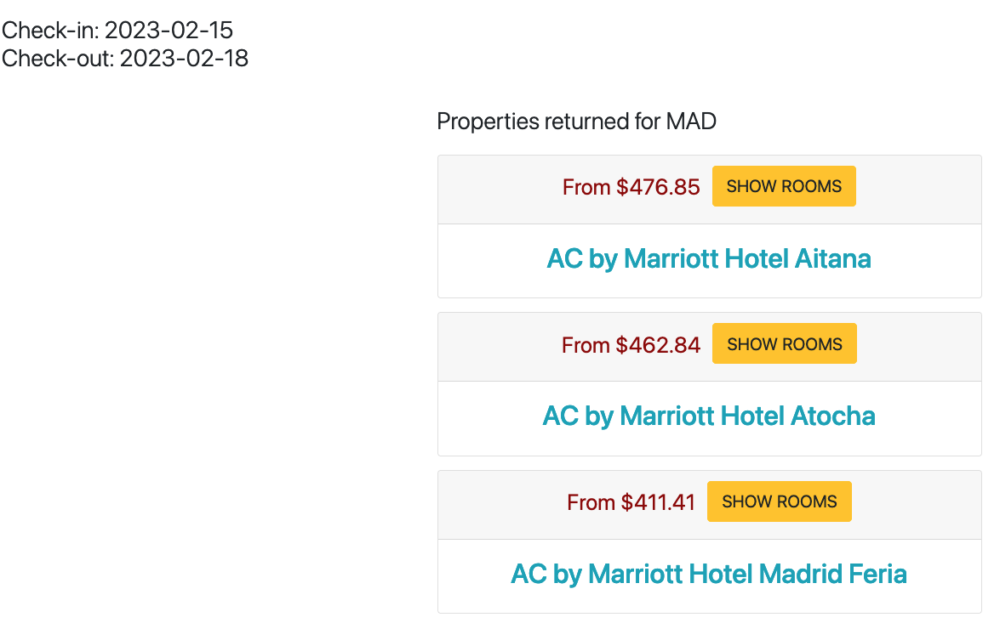
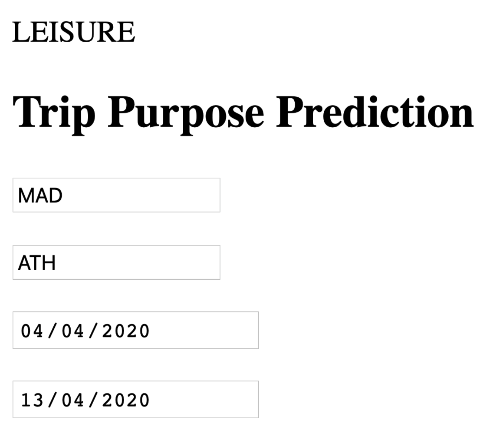
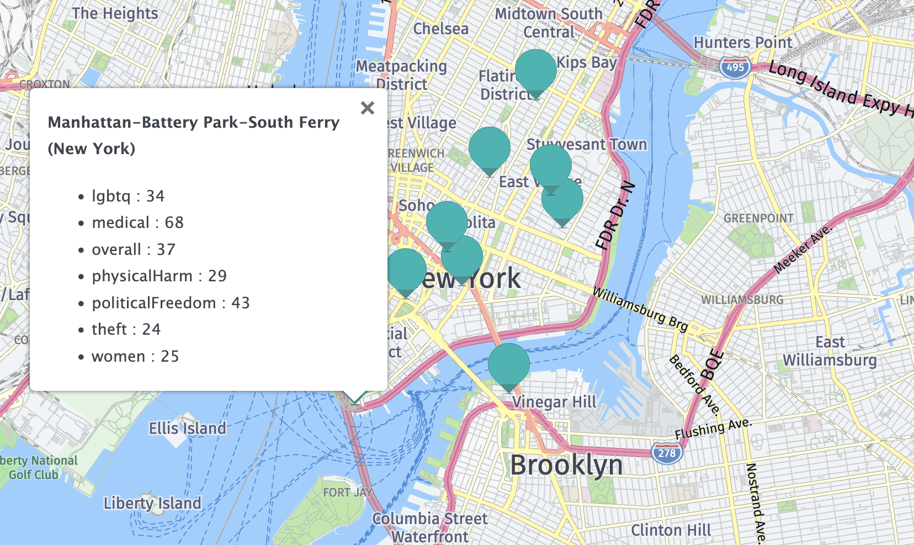
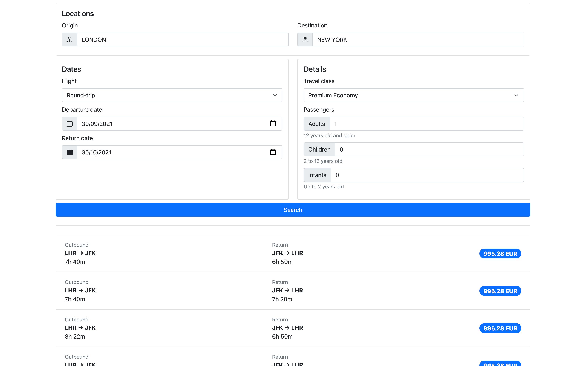
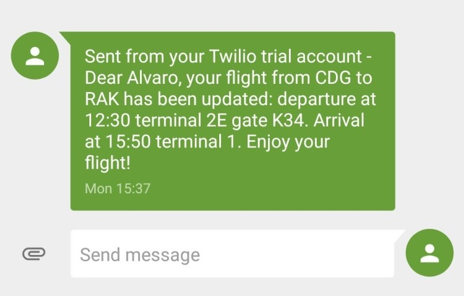

# Prototypes 

Would you like to explore the applications that you could build with Amadeus Self-Service APIs?
We have prototypes available in [Amadeus for Developers GitHub](https://github.com/amadeus4dev).

There are two types of prototypes (demo apps) available. 

* [Official prototypes](#official-prototypes) are managed by Amadeus for Developers team and updated frequently to the latest version of APIs and SDKs. 
* [Community prototypes](#prototypes-from-community) are examples or demo apps that have been built and managed by developer community and it is not supported or maintained by Amadeus for Developers team. 

## Official Prototypes

| Use Cases                                             | Amadeus APIs used                                                                                           | Technology               | Details                                                                         |
|-------------------------------------------------------|-------------------------------------------------------------------------------------------------------------|--------------------------|---------------------------------------------------------------------------------|
| Flight booking engine                                 | Flight Offers Search, Flight Offers Price, Flight Create Order, Airport & City Search, Travel Restrictions  | Python, django           | [amadeus-flight-booking-django](#amadeus-flight-booking-django)                 |
| Hotel Booking engine                                  | Hotel List, Hotel Search, Hotel Booking                                                                                 | Python, django           | [amadeus-hotel-booking-django](#amadeus-hotel-booking-django)                   |
| Flight Search with Price Analysis & Trip purpose      | Flight Offers Search, Flight Price Analysis, Trip Purpose Prediction                                        | Python, django           | [amadeus-flight-price-analysis-django](#amadeus-flight-price-analysis-django)   |
| Map with Hotels, Point of interests and Safety scores | Hotel List, Points of Interest, Safe Place, Tours and Activities                                                                | Python, django, HERE map | [amadeus-hotel-area-safety-pois-django](#amadeus-hotel-area-safety-pois-django) |
| Covid-19 info map                                     | Travel Restrictions                                                                                         | Node, Express            | [amadeus-travel-restrictions-node](#amadeus-travel-restrictions-node)           |

### amadeus-flight-booking-django
amadeus-flight-booking-django ([Link to GitHub](https://github.com/amadeus4dev/amadeus-flight-booking-django){:target="\_blank"}) is built with Django and [Python SDK](../developer-tools/python.md) and demonstrates the end-to-end flight booking process (Flight booking engine), which works in conjunction with three APIs: [Flight Offer Search API](https://developers.amadeus.com/self-service/category/air/api-doc/flight-offers-search){:target="\_blank"}, [Flight Offer Price API](https://developers.amadeus.com/self-service/category/air/api-doc/flight-offers-price){:target="\_blank"} and [Flight Create Orders API](https://developers.amadeus.com/self-service/category/air/api-doc/flight-create-orders). 

It also uses [Airport & City Search API](https://developers.amadeus.com/self-service/category/air/api-doc/airport-and-city-search){:target="\_blank"} to autocomplete the origin and destination with IATA code, and [Travel Restrictions API](https://developers.amadeus.com/self-service/category/covid-19-and-travel-safety/api-doc/travel-restrictions){:target="\_blank"} to return COVID-19 travel restriction information for destination country. 

### amadeus-hotel-booking-django
amadeus-hotel-booking-django ([Link to GitHub](https://github.com/amadeus4dev/amadeus-hotel-booking-django){:target="\_blank"}) is built with Django and [Python SDK](../developer-tools/python.md). It demonstrates the end-to-end Hotel booking process (Hotel booking engine), which works in conjunction with three APIs: [Hotel List API](https://developers.amadeus.com/self-service/category/hotel/api-doc/hotel-list){:target="\_blank"}, [Hotel Search API](https://developers.amadeus.com/self-service/category/hotel/api-doc/hotel-search){:target="\_blank"} and [Hotel Booking API](https://developers.amadeus.com/self-service/category/hotel/api-doc/hotel-booking){:target="\_blank"}. 

### amadeus-flight-price-analysis-django
amadeus-flight-price-analysis-django ([Link to GitHub](https://github.com/amadeus4dev/amadeus-flight-price-analysis-django){:target="\_blank"}) is built with Django and [Python SDK](../developer-tools/python.md). It retrieves flight offers using the Flight Offers Search API for a given itinerary. Then it displays if the cheapest available flight is a good deal based on the Flight Price Analysis API. We finally predict if the trip is for business or leisure using the Trip Purpose Prediction API.

### amadeus-hotel-area-safety-pois-django
amadeus-hotel-area-safety-pois-django ([Link to GitHub](https://github.com/amadeus4dev/amadeus-hotel-area-safety-pois-django){:target="\_blank"}) built by Django and [Python SDK](../developer-tools/python.md), It demonstrate the safety information, POIs and tours for a chosen hotel on the map, using the following APIs:

* [Hotel List](https://developers.amadeus.com/self-service/category/hotel/api-doc/hotel-list){:target="\_blank"}: shows hotels on the map
* [Points of Interest](https://developers.amadeus.com/self-service/category/destination-content/api-doc/points-of-interest){:target="\_blank"}: shows POIs around the hotel
* [Safe Place](https://developers.amadeus.com/self-service/category/covid-19-and-travel-safety/api-doc/safe-place){:target="\_blank"}: shows safety information for the area each hotel is located
* [Tours and Activities](https://developers.amadeus.com/self-service/category/destination-content/api-doc/tours-and-activities){:target="\_blank"}: shows bookable tours and activities around the hotel
* [HERE Maps](https://developer.here.com/){:target="\_blank"}: displays a map with markers and text bubbles

### amadeus-travel-restrictions-node

amadeus-travel-restrictions-node ([Link to GitHub](https://github.com/amadeus4dev/amadeus-travel-restrictions-node){:target="\_blank"}) built by Node, Express and [Node SDK](../developer-tools/node.md), It demonstrate Travel Restrictions for USA displayed on a map. We use the following APIs:

* [Travel Restrictions](https://developers.amadeus.com/self-service/category/covid-19-and-travel-safety/api-doc/travel-restrictions){:target="\_blank"}: returns Travel Restrictions
* [HERE Maps for JavaScript](https://developer.here.com/): displays a map with markers and text bubbles

## Prototypes from community 

We have many other prototypes or demo apps that developers in our community built and shared! Explore them below or in [Amadeus for Developers -Examples GitHub](https://github.com/amadeus4dev-examples){:target="\_blank"}. 

!!! warning
    Projects from communities are examples that have been built and managed by developer community([Discord](https://discord.com/invite/cVrFBqx){:target="\_blank"}) and it is not supported or maintained by Amadeus for Developers team. The projects may not be up-to-date. 

| Use case                                   | Amadeus APIs used                                                                                 | Technology           | Details                                                                                                          |
|--------------------------------------------|---------------------------------------------------------------------------------------------------|----------------------|------------------------------------------------------------------------------------------------------------------|
| Trip purpose prediction                    | Trip Purpose Prediction                                                                           | Python, django       | [amadeus-trip-purpose-django](#amadeus-trip-purpose-django)                                                                                      |
| Hotel Search                               | Hotel Search                                                                                      | Swift                | [amadeus-hotel-search-swift](#amadeus-hotel-search-swift)                                                                                       |
| Hotel booking engine                       | Hotel Search, Hotel Booking                                                                       | Kotlin               | [amadeus-hotel-booking-android](#amadeus-hotel-booking-android)                                                                                    |
| Flight Search with Artificial intelligence | Flight Offers Search, Flight Choice Prediction, Trip Purpose Prediction and Airport & City Search | Python, django       | [amadeus-smart-flight-search-django](#amadeus-smart-flight-search-django)                                                                              |
| Flight Search                              | Flight Offers Search                                                                              | PHP, wordpress       | [amadeus-flight-search-wordpress-plugin](#amadeus-flight-search-wordpress-plugin)                                                                           |
| Flight Booking engine                      | Flight Offers Search, Flight Offers price, Flight Create Orders, Airport & City Search             | Java, React          | [amadeus_java_flight_api](#amadeus_java_flight_api)                                                                                          |
| Airport & City autocomplete                | Airport & City Search                                                                             | Node, Express, React | [amadeus-airport-city-search-mern](#amadeus-airport-city-search-mern)                                                                                 |
| Flight Seatmap display                     | SeatMap Display                                                                                   | React                | [amadeus-seatmap](#amadeus-seatmap)                                                                                                  |
| Hotel booking engine                       | Hotel Search, Hotel Booking                                                                       | React Native         | [AmadeusNodeServer, AmadeusHotelBookingPart1](#amadeusnodeserver-amadeushotelbookingpart1)                                                                      |
| Hotel booking engine                       | Airport & City Search, Hotel Search, Hotel Booking                                                | Node, React          | [Building-a-Hotel-Booking-App-in-NodeJS-and-React](#building-a-hotel-booking-app-in-nodejs-and-react) |
| Neighborhood safety map                    | Safe Place                                                                                        | Python               | [amadeus-safeplace](#amadeus-safeplace)                                                                                                |
| Map nearby                                 | Points of Interests                                                                                | Swift                | [MyPlaces](#myplaces)                                                                                                         |
| Flight Booking engine              | Flight Offers Search, Flight Offers price, Flight Create Orders, Airport & City Search             | Node, Angular        | [Flight-booking-frontend and backend](#flight-booking-frontend-and-backend)                                                                                                                                                                   |
| Flight Search backend                      | Flight Offers Search, Airport & City Search                                                        | Bootstrap, Vanila JS | [Building-a-Flight-Search-Form-with-Bootstrap-and-the-Amadeus-API](#building-a-flight-search-form-with-bootstrap-and-the-amadeus-api)                                          |
| Map nearby                                 | Points of Interests                                                                                | Android              | [Amadeus_POI_Android](#amadeus_poi_android)                                                                                              |
| Hotel booking engine                       | Hotel Search, Hotel Booking                                                                       | Ruby on Rails        | [amadeus-hotel-booking-rubyonrails](#amadeus-hotel-booking-rubyonrails)                                                                                |
| Flight status notification service         | On-Demand Flight Status                                                                           | Python               | [amadeus-async-flight-status](#amadeus-async-flight-status)                                                                                      |
| Flight Calendar search                     | Airport & City Search, Flight Offers Search                                                                                                  | Node, Svelte                 | [FlightSearchCalendar](#flightsearchcalendar)                                                                                             |
| Airport & City autocomplete                | Airport & City Search                                                                             | Node and Express     | [Live-Airport-City-Search](#live-airport-city-search)                                                                                         |
| Flight Booking      | Flight Offers Search, Flight Offers Price, Flight Create Orders                                        | Node, Vue                | [amadeus-flight-booking-node](#amadeus-flight-booking-node)                   |

### amadeus-trip-purpose-django

This project ([Link to GitHub](https://github.com/amadeus4dev-examples/amadeus-trip-purpose-django){:target="\_blank"}) demonstrates how to integrate Amadeus APIs using the [Python SDK](../developer-tools/python.md) in a Django application. The end user submits round-trip information via a form and the [Trip Purpose Prediction](https://developers.amadeus.com/self-service/category/trip/api-doc/trip-purpose-prediction){:target="\_blank"} is called. This API predicts if the given journey is for leisure or business purposes.

### amadeus-hotel-search-swift
This prototype ([Link to GitHub](https://github.com/amadeus4dev-examples/amadeus-hotel-search-swift){:target="\_blank"}) demonstrates a simple iOS hotel search app from scratch using Amadeus Hotel Search API (version 2.1 - decommissioned) and [iOS SDK](https://github.com/amadeus4dev-examples/amadeus-ios){:target="\_blank"}.

### amadeus-hotel-booking-android
This prototype ([Link to GitHub](https://github.com/amadeus4dev-examples/amadeus-hotel-booking-android){:target="\_blank"}) shows how to use the [Android SDK](https://github.com/amadeus4dev-examples/amadeus-android){:target="\_blank"} to build a Hotel Booking Engine in Android Studio. 

###  amadeus-smart-flight-search-django
This prototype ([Link to GitHub](https://github.com/amadeus4dev-examples/amadeus-smart-flight-search-django){:target="\_blank"}) shows how the Air APIs can be integrated with the Django framework and [Python SDK](../developer-tools/python.md), by calling the [Flight Choice Prediction](https://developers.amadeus.com/self-service/category/air/api-doc/flight-choice-prediction){:target="\_blank"} and [Trip Purpose Prediction](https://developers.amadeus.com/self-service/category/trip/api-doc/trip-purpose-prediction){:target="\_blank"}. We also call the [Flight Offers Search](https://developers.amadeus.com/self-service/category/air/api-doc/flight-offers-search){:target="\_blank"} as a more traditional method of flight search and we compare its results with the [Flight Choice Prediction](https://developers.amadeus.com/self-service/category/air/api-doc/flight-choice-prediction){:target="\_blank"} ones to show the power of AI.

### amadeus-flight-search-wordpress-plugin

This prototype ([Link to GitHub](https://github.com/amadeus4dev-examples/amadeus-flight-search-wordpress-plugin){:target="\_blank"})  demonstrated how to create a WordPress plugin to build a basic flight search feature using [Flight Offers Search API](https://developers.amadeus.com/self-service/category/air/api-doc/flight-offers-search){:target="\_blank"}.

### amadeus_java_flight_api

This app ([Link to GitHub](https://github.com/amadeus4dev-examples/amadeus_java_flight_api){:target="\_blank"}) is an example of how to use the Amadeus Flight APIs to search and book a flight. The application uses a Spring backend and a React frontend.

### amadeus-airport-city-search-mern
This application ([Link to GitHub](https://github.com/amadeus4dev-examples/amadeus-airport-city-search-mern){:target="\_blank"}) implements airport and city name autocomplete box powered by the [Airport & City Search API](https://developers.amadeus.com/self-service/category/air/api-doc/airport-and-city-search){:target="\_blank"}. It consists of a simple Node and Express backend that connects to the Amadeus API with [Node SDK](../developer-tools/node.md), and a small React app that talks to a Node/Express backend and use it to obtain the airport name data from Amadeus.

### amadeus-seatmap
This prototype ([Link to GitHub](https://github.com/amadeus4dev-examples/amadeus-seatmap){:target="\_blank"}) demonstrates how to display a flight seatmap using [SeatMap Display API](https://developers.amadeus.com/self-service/category/air/api-doc/seatmap-display){:target="\_blank"} with React. 

* [How to build an aircraft seat map in React](https://developers.amadeus.com/blog/react-seat-map){:target="\_blank"}

### AmadeusNodeServer, AmadeusHotelBookingPart1
This prototype consists of 2 Github repositories ([GitHub to Node Server](https://github.com/amadeus4dev-examples/AmadeusNodeServer){:target="\_blank"} and [GitHub to React Native](https://github.com/amadeus4dev-examples/AmadeusHotelBookingPart1){:target="\_blank"}). It demonstrates a Hotel booking application in iOS using React Native. There is a series of blogs to elaborate further to build an app with this prototype. 

* [Building an iOS hotel booking app with React Native - Part 1](https://developers.amadeus.com/blog/react-native-hotel-booking-app){:target="\_blank"}
* [Building an iOS hotel booking app with React Native - Part 2](https://developers.amadeus.com/blog/react-native-hotel-booking-app-part-2){:target="\_blank"} 

### amadeus-safeplace

This prototype ([Link to GitHub](https://github.com/amadeus4dev-examples/amadeus-safeplace){:target="\_blank"}) demonstrates a neighbourhood safety map in Python to let users compare the relative safety levels of different neighbourhoods. You will use the Safe Place API for the safety scores and HERE Maps to visualize them on a map.

* [How to build a neighbourhood safety map in Python with Amadeus Safe Place](https://github.com/amadeus4dev-examples/amadeus-safeplace)

### MyPlaces

This prototype ([Link to GitHub](https://github.com/amadeus4dev-examples/MyPlaces){:target="\_blank"}) demonstrates an iOS application that finds nearby places and displays them on a map. You will use the [Points of Interest API](https://developers.amadeus.com/self-service/category/destination-content/api-doc/points-of-interest){:target="\_blank"} to retrieve the places and MKMapView for the map.

* [How to get nearby places using Amadeus APIs in iOS](https://developers.amadeus.com/blog/getting-nearby-places-ios-amadeus-api){:target="\_blank"}

### Building-a-Hotel-Booking-App-in-NodeJS-and-React

This prototype consists of 2 code sets ([Github to Backend](https://github.com/amadeus4dev-examples/Building-a-Hotel-Booking-App-in-NodeJS-and-React-Part-1){:target="\_blank"} and [Github to Frontend](https://github.com/amadeus4dev-examples/Building-a-Hotel-Booking-App-in-NodeJS-and-React-Part-2){:target="\_blank"}). It demonstrates a complete hotel booking app using Node on the backend and React for the frontend. 

* [Building a hotel booking app with Node.js and React - Part 1](https://developers.amadeus.com/blog/react-hotel-booking-app-part1){:target="\_blank"}

* [Building a hotel booking app with Node.js and React - Part 2](https://developers.amadeus.com/blog/react-hotel-booking-app-part2){:target="\_blank"}

### Flight-booking-frontend and backend
This prototype consists of 2 code sets ([Github to Backend](https://github.com/amadeus4dev-examples/flight-booking-backend){:target="\_blank"} and [Github to Frontend](https://github.com/amadeus4dev-examples/flight-booking-backend){:target="\_blank"}). It demonstrates a complete flight booking application using Node in the backend and Angular for the front end.

* [Build a flight booking app with Angular and Node.js - Part 1](https://developers.amadeus.com/blog/flight-booking-app-angular-1){:target="\_blank"}
* [Build a flight booking app with Angular and Node.js - Part 2](https://developers.amadeus.com/blog/flight-booking-app-angular-2){:target="\_blank"}

### Building-a-Flight-Search-Form-with-Bootstrap-and-the-Amadeus-API
This prototype consists of 2 code sets ([Github to Frontend](https://github.com/amadeus4dev-examples/Building-a-Flight-Search-Form-with-Bootstrap-and-the-Amadeus-API-Part-1){:target="\_blank"} and [Github to Backend](https://github.com/amadeus4dev-examples/Building-a-Flight-Search-Form-with-Bootstrap-and-the-Amadeus-API-Part-2){:target="\_blank"}). It demonstrates a flight booking engine with [Flight Offer Search API](https://developers.amadeus.com/self-service/category/air/api-doc/flight-offers-search){:target="\_blank"} using Bootstrap and Vanilla JS for frontend and Express for the backend. 

* [How to build a flight search form using Bootstrap 5 - Part 1](https://developers.amadeus.com/blog/bootstrap-flight-search-form-part-1){:target="\_blank"}
* [How to build a flight search form using Bootstrap 5 - Part 2](https://developers.amadeus.com/blog/bootstrap-flight-search-form-part-2){:target="\_blank"}

### Amadeus_POI_Android
This app ([Link to GitHub](https://github.com/amadeus4dev-examples/Amadeus_POI_Android){:target="\_blank"}) demonstrates the usage of [Amadeus Points of Interest API](https://developers.amadeus.com/self-service/category/destination-content/api-doc/points-of-interest){:target="\_blank"} to
fetch the list of best attractions near the user's current location and
displays them on a list as well as a map.

### amadeus-hotel-booking-rubyonrails
This prototype ([Link to GitHub](https://github.com/amadeus4dev-examples/amadeus-hotel-booking-rubyonrails){:target="\_blank"}) demonstrates an end-to-end Hotel booking process, which works in conjunction with 2 APIs, Hotel Search API and Hotel Booking API. 

### amadeus-async-flight-status
This prototype ([Link to GitHub](https://github.com/amadeus4dev-examples/amadeus-async-flight-status){:target="\_blank"}) demonstrates an application with event-driven microservices that asynchronously consume events coming from the API and notifies end users of these events via SMS using Twilio SMS API. 

* [Event-driven microservices for flight status alerts: part 1](https://developers.amadeus.com/blog/event-driven-microservices-flight-status-alerts-twilio-part1){:target="\_blank"}

* [Event-driven microservices for flight status alerts: part 2](https://developers.amadeus.com/blog/event-driven-microservices-flight-status-alerts-twilio-part2){:target="\_blank"}

### FlightSearchCalendar
This application ([Link to GitHub](https://github.com/amadeus4dev-examples/FlightSearchCalendar/tree/master){:target="\_blank"}) demonstrates a calendar application to display the flights within a date interval to find the cheapest possible prices using Amadeus APIs.

###  Live-Airport-City-Search
This application ([Link to GitHub](https://github.com/amadeus4dev-examples/Live-Airport-City-Search){:target="\_blank"}) lets you perform a live search for Airports and Cities through the [Airport & City Search API](https://developers.amadeus.com/self-service/category/air/api-doc/airport-and-city-search){:target="\_blank"}. The implementation is done through jQuery Autocomplete with Node and Express as the backend for which connects to the Amadeus API with [Node SDK](../developer-tools/node.md).

### amadeus-flight-booking-node 
The Amadeus Flight Booking app is built with Node and Vue using the [Node SDK](../developer-tools/node.md). You can find the source code [on GitHub](https://github.com/amadeus4dev/amadeus-flight-booking-node){:target="\_blank"} 