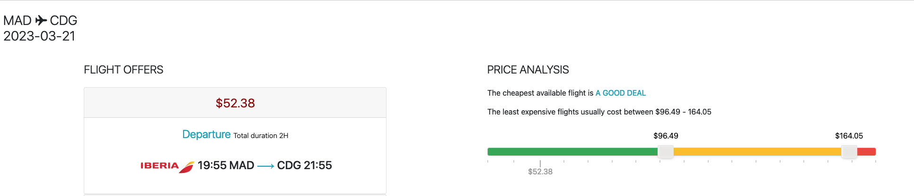
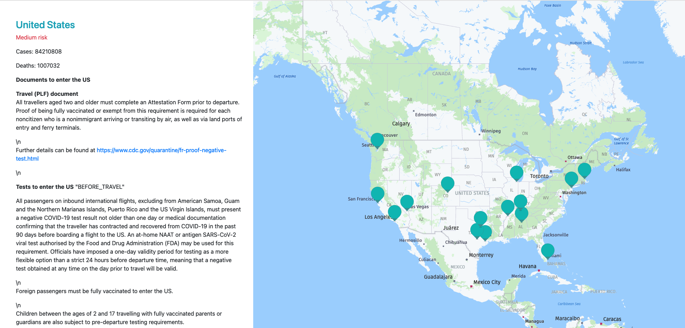

# Prototypes 

Would you like to explore the applications that you could build with Amadeus Self-Service APIs?
We have prototypes available in [Amadeus for Developers GitHub](https://github.com/amadeus4dev).

There are two types of prototypes (demo apps) available. 

* [Official prototypes](#amadeus-official-prototypes-or-demo-apps) are managed by Amadeus for Developers team and updated frequently to the latest version of APIs and SDKs. 
* [Community prototypes](#prototypes-from-community) are examples or demo apps that have been built and managed by developer community and it is not supported or maintained by Amadeus for Developers team. 

## Official Prototypes

| Use Cases                                             | Amadeus APIs used                                                                                           | Technology               | Details                                                                         |
|-------------------------------------------------------|-------------------------------------------------------------------------------------------------------------|--------------------------|---------------------------------------------------------------------------------|
| Flight booking engine                                 | Flight Offers Search, Flight Offers Price, Flight Create Order, Airport & City Search, Travel Restrictions  | Python, django           | [amadeus-flight-booking-django](#amadeus-flight-booking-django)                 |
| Hotel Booking engine                                  | Hotel Search, Hotel Booking                                                                                 | Python, django           | [amadeus-hotel-booking-django](#amadeus-hotel-booking-django)                   |
| Flight Search with Price Analysis & Trip purpose      | Flight Offers Search, Flight Price Analysis, Trip Purpose Prediction                                        | Node, Vue                | [amadeus-flight-booking-node](#amadeus-flight-booking-node)                   |
| Flight Search with Price Analysis & Trip purpose      | Flight Offers Search, Flight Price Analysis, Trip Purpose Prediction                                        | Python, django           | [amadeus-flight-price-analysis-django](#amadeus-flight-price-analysis-django)   |
| Map with Hotels, Point of interests and Safety scores | Hotel Search, Points of Interest, Safe Place                                                                | Python, django, HERE map | [amadeus-hotel-area-safety-pois-django](#amadeus-hotel-area-safety-pois-django) |
| Covid-19 info map                                     | Travel Restrictions                                                                                         | Node, express            | [amadeus-travel-restrictions-node](#amadeus-travel-restrictions-node)           |

### amadeus-flight-booking-django
amadeus-flight-booking-django ([Link to GitHub](https://github.com/amadeus4dev/amadeus-flight-booking-django){:target="\_blank"}) is built with Django and [Python SDK](../programming/python.md) and demonstrates the end-to-end flight booking process (Flight booking engine), which works in conjunction with three APIs: [Flight Offer Search API](https://developers.amadeus.com/self-service/category/air/api-doc/flight-offers-search){:target="\_blank"}, [Flight Offer Price API](https://developers.amadeus.com/self-service/category/air/api-doc/flight-offers-price){:target="\_blank"} and [Flight Create Orders API](https://developers.amadeus.com/self-service/category/air/api-doc/flight-create-orders). 

It also uses [Airport & City Search API](https://developers.amadeus.com/self-service/category/air/api-doc/airport-and-city-search){:target="\_blank"} to autocomplete the origin and destination with IATA code, and [Travel Restrictions API](https://developers.amadeus.com/self-service/category/covid-19-and-travel-safety/api-doc/travel-restrictions){:target="\_blank"} to return COVID-19 travel restriction information for destination country. 

### amadeus-hotel-booking-django
amadeus-hotel-booking-django ([Link to GitHub](https://github.com/amadeus4dev/amadeus-hotel-booking-django){:target="\_blank"}) is built with Django and [Python SDK](../programming/python.md). It demonstrates the end-to-end Hotel booking process (Hotel booking engine), which works in conjunction with three APIs: [Hotel List API](https://developers.amadeus.com/self-service/category/hotel/api-doc/hotel-list){:target="\_blank"}, [Hotel Search API](https://developers.amadeus.com/self-service/category/hotel/api-doc/hotel-search){:target="\_blank"} and [Hotel Booking API](https://developers.amadeus.com/self-service/category/hotel/api-doc/hotel-booking){:target="\_blank"}. 

### amadeus-flight-booking-node 
amadeus-flight-booking-node ([Link to GitHub](https://github.com/amadeus4dev/amadeus-flight-booking-node){:target="\_blank"}) is built by Node, Vue and [Node SDK](../programming/node.md). 

### amadeus-flight-price-analysis-django
amadeus-flight-price-analysis-django ([Link to GitHub](https://github.com/amadeus4dev/amadeus-flight-price-analysis-django){:target="\_blank"}) is built with Django and [Python SDK](../programming/python.md). It retrieves flight offers using the Flight Offers Search API for a given itinerary. Then it displays if the cheapest available flight is a good deal based on the Flight Price Analysis API. We finally predict if the trip is for business or leisure using the Trip Purpose Prediction API.

### amadeus-hotel-area-safety-pois-django
amadeus-hotel-area-safety-pois-django ([Link to GitHub](https://github.com/amadeus4dev/amadeus-hotel-area-safety-pois-django){:target="\_blank"}) built by Django and [Python SDK](../programming/python.md), It demonstrate the safety information, POIs and tours for a chosen hotel on the map, using the following APIs:

* [Hotel Search](https://developers.amadeus.com/self-service/category/hotel/api-doc/hotel-list){:target="\_blank"}: shows hotels on the map
* [Points of Interest](https://developers.amadeus.com/self-service/category/destination-content/api-doc/points-of-interest){:target="\_blank"}: shows POIs around the hotel
* [Safe Place](https://developers.amadeus.com/self-service/category/covid-19-and-travel-safety/api-doc/safe-place){:target="\_blank"}: shows safety information for the area each hotel is located
* [Tours and Activities](https://developers.amadeus.com/self-service/category/destination-content/api-doc/tours-and-activities){:target="\_blank"}: shows bookable tours and activities around the hotel
* [HERE Maps](https://developer.here.com/){:target="\_blank"}: displays a map with markers and text bubbles

### amadeus-travel-restrictions-node

amadeus-travel-restrictions-node ([Link to GitHub](https://github.com/amadeus4dev/amadeus-travel-restrictions-node){:target="\_blank"}) built by Node, Express and [Node SDK](../programming/node.md), It demonstrate Travel Restrictions for USA displayed on a map. We use the following APIs:

* [Travel Restrictions](https://developers.amadeus.com/self-service/category/covid-19-and-travel-safety/api-doc/travel-restrictions){:target="\_blank"}: returns Travel Restrictions
* [HERE Maps for JavaScript](https://developer.here.com/): displays a map with markers and text bubbles

## Prototypes from community 

We have many other prototypes or demo apps that developers in our community built and shared! Explore them in [Amadeus for Developers -Examples GitHub](https://github.com/amadeus4dev-examples){:target="\_blank"} 

!!! warning
    Projects from communities are examples that have been built and managed by developer community and it is not supported or maintained by Amadeus for Developers team. the projects may not up-to-date. 

!!! danger
    The list of community projects is working in progress.

| Use Cases                  | Blog Link                                                                                                                                                                                                                                                  |
| -------------------------- | ------------------------------------------------------------------------------------------------------------------------------------------------------------------------------------------------------------------------------------------------------------ |
| Covid-19                   | [Neighborhood safety map in Python with Amadeus Safe Place](https://developers.amadeus.com/blog/neighborhood-safety-map-python)                                                                                                                     |
| Flight booking             | [Flight booking app in Java and React - Part 1](https://developers.amadeus.com/blog/flight-booking-application-java-spring-react-1) |
| Flight booking             | [Flight booking app in Java and React - Part 2](https://developers.amadeus.com/blog/flight-booking-application-java-spring-react-2) |
| Flight booking             | [Flight booking app with Angular and Node.js - Part 1](https://developers.amadeus.com/blog/flight-booking-app-angular-1)                                                                                                                         |
| Flight booking             | [Flight booking app with Angular and Node.js - Part 2](https://developers.amadeus.com/blog/flight-booking-app-angular-2)                                                                                                                         |
| Flight Search              | [Flight search form using Bootstrap 5 - Part 1](https://developers.amadeus.com/blog/bootstrap-flight-search-form-part-1)                                                                                                           |
| Flight Search              | [Flight search form using Bootstrap 5 - Part 2](https://developers.amadeus.com/blog/bootstrap-flight-search-form-part-2)                                                                                                           |
| Flight Seat Map            | [Aircraft seat map in React](https://developers.amadeus.com/blog/react-seat-map)                                                                                                                                                     |
| Hotel Booking              | [iOS hotel booking app with React Native - Part 1](https://developers.amadeus.com/blog/react-native-hotel-booking-app)                                                                                                                     |
| Hotel Booking              | [iOS hotel booking app with React Native - Part 2](https://developers.amadeus.com/blog/react-native-hotel-booking-app-part2)                                                  |
| Hotel Booking           | [Hotel booking app with Node.js and React - Part 1](https://developers.amadeus.com/blog/react-hotel-booking-app-part1)                                                                                                                       |
| Hotel Booking              | [Hotel booking app with Node.js and React - Part 2](https://developers.amadeus.com/blog/react-hotel-booking-app-part2)                                                                                                                       |
| Destination Experiences    | [Get nearby places using Amadeus APIs in iOS](https://developers.amadeus.com/blog/getting-nearby-places-ios-amadeus-api)                                                                                                       |